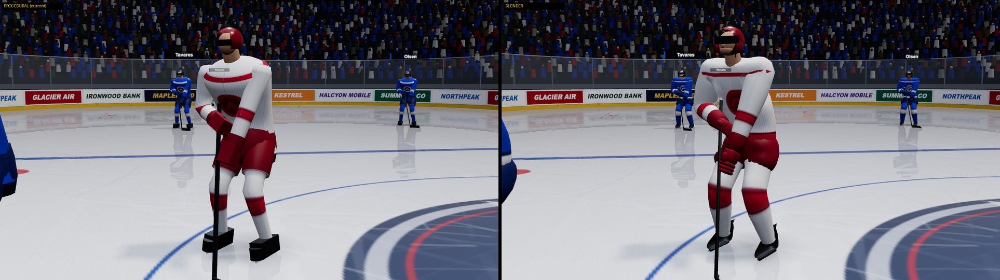
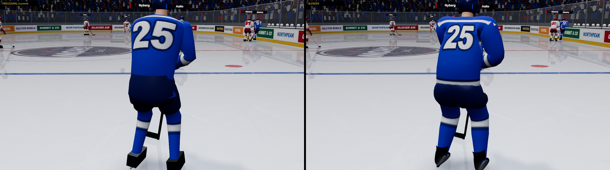
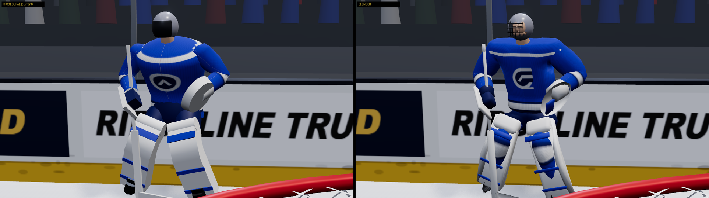
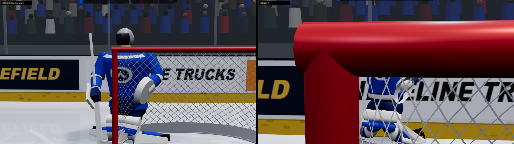
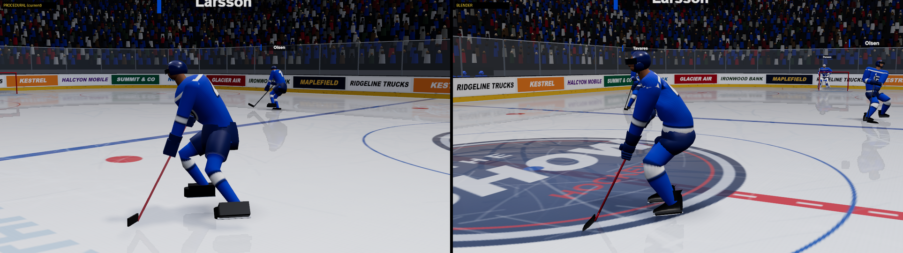
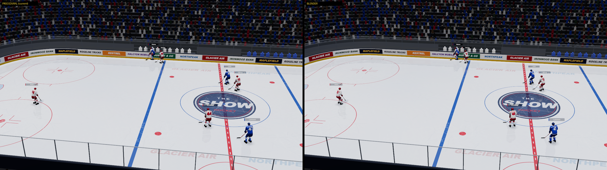

# Blender athlete pipeline

Status: 2026-09-26, branch `blender-3d`. The bake-off is done. The **Blender
athletes are now the default** (`RENDER3D_DEFAULTS = { athletes: 'blender',
locomotion: 'hybrid' }` in `src/render3d/rink3dRenderer.ts`). The procedural
bodies are still there. They are used automatically if the .glb fails to load,
and you can force them with `Rink3dRenderer.create(host, colors, { athletes: 'procedural' })`.

> Next step (coordinator, 2026-09-26): the owner will supply his own rigged
> skater and goalie with animations. An import pipeline, `scripts/blender/import_owner_assets.py`,
> will map them onto this same skeleton and catalogue. The models described
> here become the **fallback**. Any clip slot the owner's files don't cover
> keeps the Blender clip.

## 1. Bake-off verdict

Every image puts procedural on the left and Blender on the right. Both sides
use the same harness shot, the same seed and the same frame.
`bash scripts/dev/render3d-harness/bakeoff.sh` regenerates them.

| Part | Winner | Why |
|---|---|---|
| **Body mesh** | **Blender** | The procedural body is primitives, and at close range it reads as a mannequin: box skates, separate tubes, a hard sweater/pants seam. The Blender body is one continuous skinned surface, with the sweater and breezers grown via the Skin modifier. The sweater hangs loose over the shoulder pads and has a hem stripe. The breezers flare. It has real skate boots with steel, a goalie cage mask and shaped pads. |
| **Forward stride** | **Tie → code** | Side by side in the gait lab (`gait-side.png`) the authored `skate_stride` and the code stride are close. The code stride is integrated from sim speed, so cadence and support-foot contact can never drift from what the sim does. Code stays. |
| **Crossovers / backward** | **Blender** | These are authored cycles, phase-locked to the code stride phase. The code had no real crossover or backward gait. |
| **Actions** (shots, passes, checks, falls, saves, celebrations) | **Blender** | The procedural renderer only had cue-driven arm swings. The authored clips have wind-ups, follow-throughs, contact frames and get-ups. |

Result: **Blender mesh + code stride + authored cycles and actions** (`hybrid`).
The mixed approach the plan allowed for is what won.

| | |
|---|---|
|  |  |
|  |  |
|  |  |

Other images in `docs/graphics/blender/`:
- `gait-side.png`: the locomotion bake-off. Eight phases of one cycle, with the procedural body + code stride, the Blender body + code stride, and the Blender body + authored stride.
- `strip-hit.png` and `strip-goal.png`: film strips from live play in hybrid mode. One shows a check coming in; the other shows a wrist shot followed by arms-up and a linemate hug.
- `clips-skater.png` and `clips-goalie.png`: Workbench key poses of the catalogue, straight from Blender.
- `bakeoff-broadcast-play.png`, `bakeoff-endzone.png` and `bakeoff-overhead.png`: earlier camera shots.

At broadcast distance the difference is small. At close range and in replays
it is large, and those shots are where the "mannequin" complaint came from.

## 2. Skeleton: bone map (1:1)

The renderer owns the skeleton (`BONE_NAMES` in `src/render3d/athlete.ts`).
`scripts/blender/rig.py` mirrors it exactly. Both use the same names, the same
rest positions (in feet) and the same convention that every rest bone frame is
identity in renderer space. `blenderAssets.test.ts` checks the exported joints
against `restBonePositions()`.

| Renderer / Blender bone | Parent | Notes |
|---|---|---|
| root | none | ground point; the SIM owns root translation and yaw |
| hips → spine → chest → neck → head | chain | |
| shoulder_L/R → upperarm → forearm → hand | chest | the hands are re-solved onto the stick by IK after the clip is applied |
| thigh_L/R → shin → foot | hips | |
| stick, stick_blade | root | the stick is placed by the rig, and clips pull it toward the authored stick |

That is 22 bones for the skater and the same 22 for the goalie, well under the
~40 budget. Axes: renderer/glTF uses +Y up, +Z as the player's front and +X as
his left. Blender uses +Z up and −Y front (`r2b`/`b2r` in rig.py).

## 3. Animation catalogue and triggers

The runtime metadata (mask, hands, loop, contact frame, chain) lives in
`src/render3d/animCatalog.ts`. The authored keys live in `scripts/blender/clips.py`.
Selection rules are pure functions with their own tests, and `choreo.ts` drives
them from the event stream. Clips start early by their **contact frame**, so
the stick meets the puck, or the shoulder meets the man, exactly at the event time.

| Clip | Trigger (stream / derived) |
|---|---|
| skate_stride, skate_glide | code (hybrid). The clips are used only with `loco=clip`. |
| skate_crossover_L/R | smoothed turn rate (`locomotionWeights`) |
| skate_back | velocity opposed to facing |
| hockey_stop | sustained hard deceleration of the smoothed speed: > 30 ft/s² for ≥ 0.12 s from > 16 ft/s, with a 3 s cooldown |
| pass | `pass` (completed) |
| shot_wrist / shot_slap / shot_onetimer | `shot`. It is a one-timer if a pass reached the shooter ≤ 0.8 s earlier, a slapshot from distance, otherwise a wrister (`shotClipFor`). |
| faceoff_crouch → faceoff_draw | `faceoff`. The two nearest skaters crouch 1.1 s before the drop, and the winner draws. |
| check / check_boards | `hit`. It becomes a boards pin within 6 ft of the boards. |
| hit_stagger / hit_stumble / hit_fall → getup | the `hit` target. Hardness comes from the relative closing speed (`hitPlan`). A fall holds 0.8 s, then chains into the get-up. During the reaction, position following is loosened (`followHL`) and then eased back, so there is no snap. |
| pinned_boards | the target of a boards hit, turned chest-to-glass by the facing spring |
| celly_fistpump / celly_armsup | `goal` scorer, with a stable per-player choice |
| celly_hug | same-team skaters within 14 ft, staggered by distance |
| g_stance | goalie idle loop |
| g_butterfly / g_pad_save / g_glove_save / g_blocker_save | `save`. The choice uses lateral offset, shot distance and a stable hash (`saveClipFor`). |
| g_scramble | about half of wide (> 2.5 ft) rebound saves |
| g_dejected | `goal` against, for the defending goalie, 0.7 s later |
| rookie_lap, salute, bench_standup | **authored, not yet triggered.** No stream event exists. They are candidates for hooks in the broadcast presentation director (pregame open, game-end salute, bench on goals). |

Layering (`animLayer.ts`): the code pose is written first. Then masked body
slerps are applied, then the stick pull, then hand IK back onto the stick, then
'clip'-hands arms. Clips never drive root position or yaw. There is no camera shake.

## 4. Motion gate and performance

The motion gate is
`node scripts/dev/render3d-harness/motion-probe.mjs "t=0.3&cam=broadcast" --secs=20 --port=<p>`:

| config | maxSpeed | framesOver40 | yawTwitchPerRigSec |
|---|---|---|---|
| default (blender/hybrid) | 40 | 0 | 0.055 – 0.073 |
| procedural/code | 40 | 0 | 0.041 |

Performance at 1080p (`shot.mjs --perf --1080`, vsync off, RTX 5090, 4 runs interleaved):

| config | avg frame ms | p95 ms | renderer CPU ms | triangles | draw calls |
|---|---|---|---|---|---|
| procedural | 3.71 / 3.89 | 5.3 / 6.0 | 2.8 – 3.0 | 673k | 103 |
| blender/hybrid | 3.44 / 4.17 | 6.0 / 6.4 | 3.9 – 4.5 | 838k | 104 |

- Frame cost is within noise of the procedural bodies, well inside the +30% budget.
- Renderer CPU is up about 1.2 ms (clip sampling plus the layer passes).
- Geometry is one shared buffer per template and the material is one shared atlas material. There is still one skinned draw per athlete (26), the same as before.
- Adaptive quality is untouched.

Asset sizes: `skater.glb` is 741 KB (4.1k vertices, 26 clips) and `goalie.glb`
is 417 KB (7 clips). Neither has embedded textures (the jersey atlas is painted
at runtime), and no third-party assets are used. Vite inlines both as `data:`
URLs in lazy chunks. The CSP allows `connect-src data:`, and they are verified
in `electron-vite build`.

## 5. Build steps

```
npm run build:athletes              # headless Blender 5.1: rebuild both .glb
npm run build:athletes -- --preview # + Workbench turnarounds / pose sheets in build/blender/
```

- Blender is found via `$BLENDER` or the default install path. The script runs `--background --factory-startup`, so no window ever opens.
- The exported `.glb` files are committed, so a fresh checkout runs without Blender.
- A rebuild is functionally identical but not byte-identical (float noise in about 4k bytes).
- Modules:
  - `rig.py`: the skeleton spec
  - `meshkit.py`: loft/skin/bevel helpers and atlas UV regions
  - `body.py`: skater and goalie meshes plus weights
  - `posekit.py`: key poses in renderer pose semantics
  - `clips.py`: the catalogue
  - `build_athletes.py`: assembly, NLA tracks, export
  - `contact_sheet.py`: preview tiling

## 6. Opening and tweaking the .blend yourself

1. Run `npm run build:athletes`. This writes `build/blender/skater.blend` and `goalie.blend` (gitignored).
2. Open one in Blender 5.1. Each clip is an **Action** on a muted NLA track. Pick it in the Action editor, then scrub, move keys or add keys.
3. To keep a hand edit permanently, port it back into `clips.py`/`body.py`. The .blend is a build output and the next rebuild overwrites it. For a one-off test, export from the file with the same glTF settings as `export_glb()` (GLB, Y-up, skins, actions mode, force sampling) into `src/render3d/assets/`, then run `npx vitest run src/render3d` to check the skeleton still matches.
4. To view the result, run `npx vite --config scripts/dev/render3d-harness/vite.config.mjs --port 5175` and open `?closeup=home:0,14,30` or `?clip=<name>`.

## 7. What's left

- **Owner-supplied assets** (in progress): the import pipeline, bone and clip mapping, and the kit (see the note at the top).
- rookie_lap, salute and bench_standup have no triggers yet (they need presentation-director hooks).
- The skater visor is an opaque dark band. Up close it reads like a bar across the eyes. It needs a tinted, partly transparent visor (a second material, +1 draw per athlete) or a thinner band.
- A slightly higher yaw-twitch figure in hybrid (0.07 vs 0.04) is still within the gate. It likely comes from boards-pin facing overrides.
- A pre-existing WebGL warning also appears in procedural mode: `GL_INVALID_OPERATION: Mismatch between texture format and sampler type`, 4 times at startup. It is not from this work.
- Goalie clips: there is no post-to-post shuffle or T-push yet. Lateral movement is the code slide.
