# 3D match renderer: graphics upgrade

This upgrade takes `src/render3d/` from procedural primitives ("tech demo") to a readable, grounded broadcast look. Everything is still authored in code: no model files, no new npm dependencies. The `three` addons it uses (EffectComposer, UnrealBloom, OutputPass, BufferGeometryUtils) ship inside `three@0.184`.

No frozen contract changed. `MatchRenderer`, `events.ts`, `views.ts` and `protocol.ts` are untouched, and so are `src/render2d/timeline.ts` and `MatchViewer.tsx`. The renderer still only reads the event stream.

## Before / after

All pairs use the same generated game (seed 3), the same moment and the same camera. The "before" images come from the pre-upgrade renderer running in the same harness.

| | Before | After |
|---|---|---|
| Broadcast (default) camera | 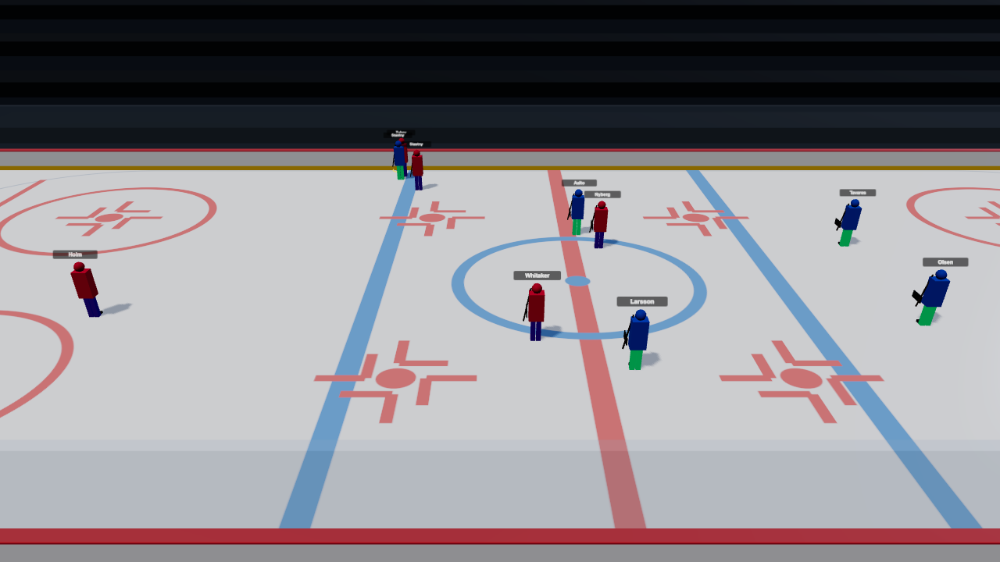 | 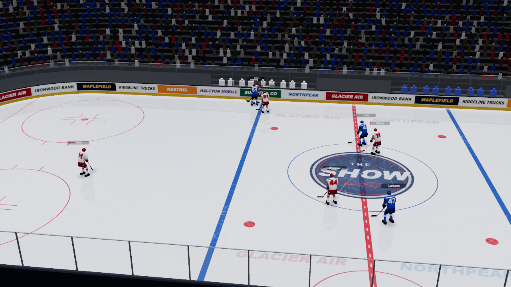 |
| Skater (follow cam) | 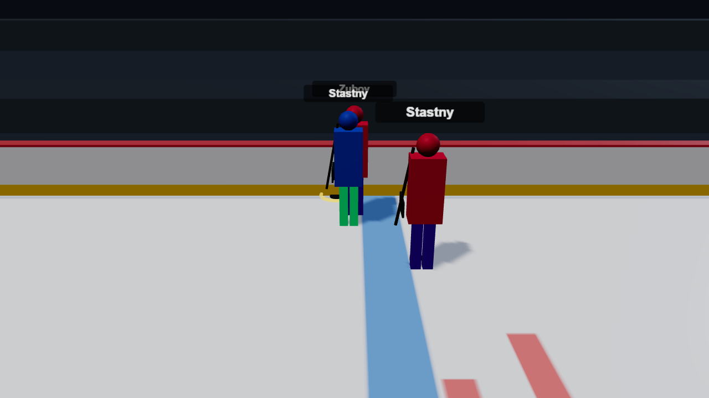 | 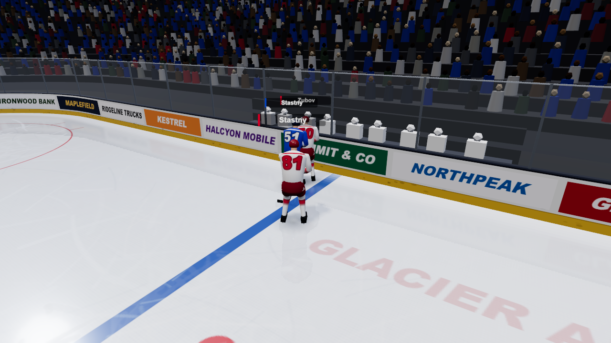 |
| Close-up: skaters in front of a net | 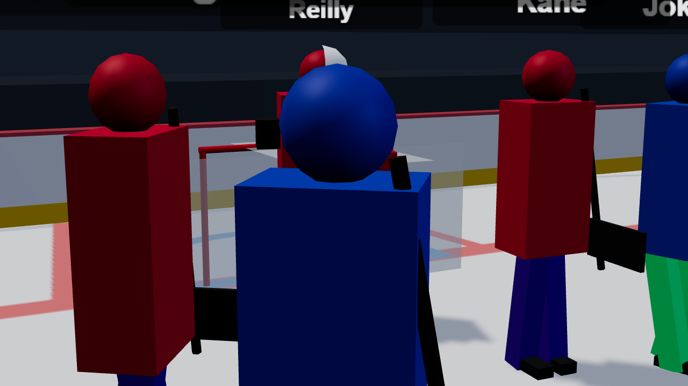 | 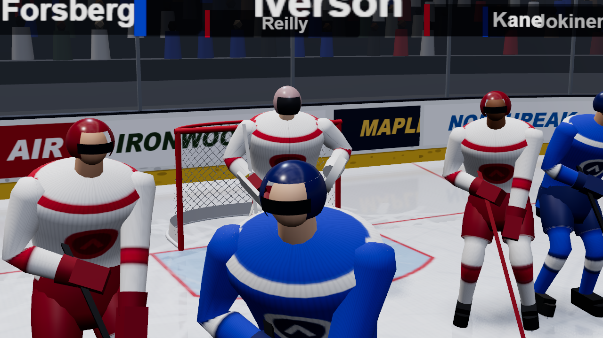 |
| Goalie close-up | 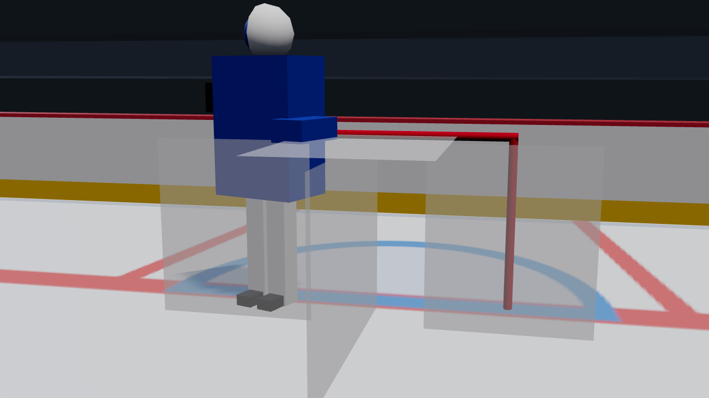 | 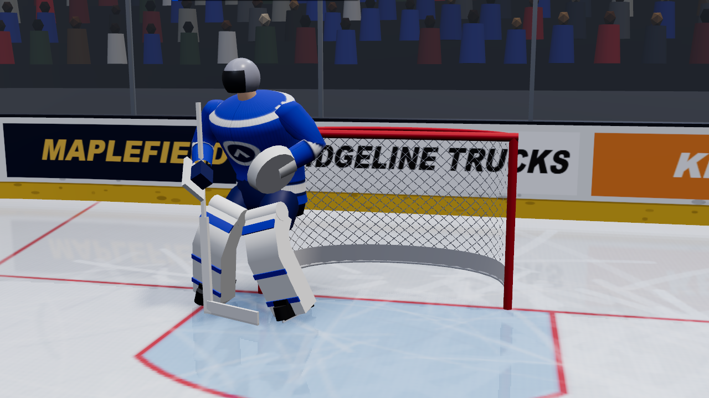 |
| Overhead | 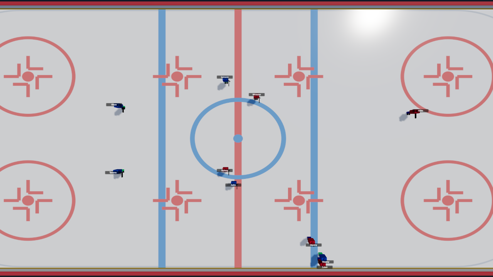 | 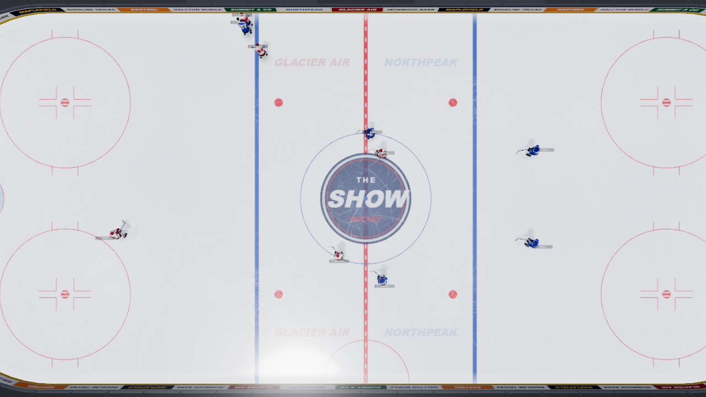 |
| Endzone | 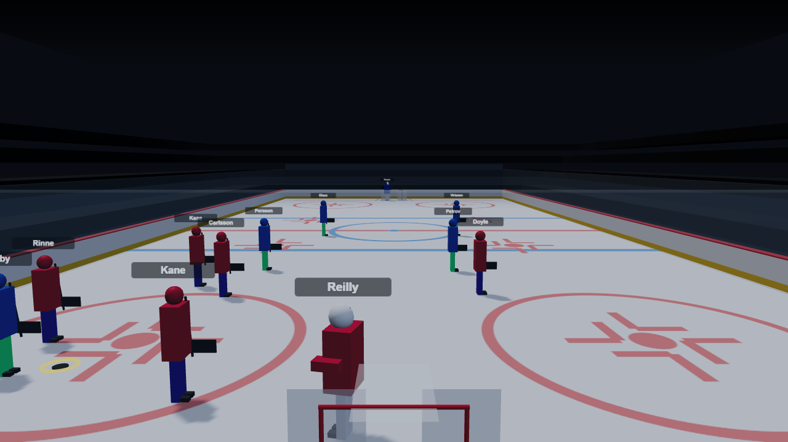 | 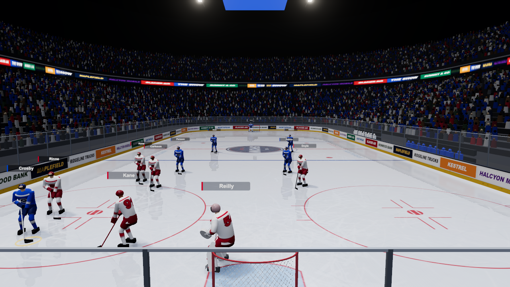 |

Additional "after" shots:
- `after-broadcast-play.png`: live play from the broadcast camera, with stances, reflections and contact shadows.
- `after-goal.png`: goal push-in, goal lamp and crowd surge.
- `after-butterfly.png`: goalie butterfly with pads flared flat on the ice.

## What changed

### Players (the owner's "not mannequins / stick figures" brief)
- **One continuous skinned mesh per player** on a named skeleton, with no floating primitives. Each limb is a single tube running *through* its joint (thigh→shin, upper arm→forearm, hips→spine→chest), with blended skin weights, so bends are continuous and no joint seams show.
- **Equipment silhouette** (`athlete.ts`):
  - a loose sweater, wider than the body, with a flared hem over bulky shoulder pads
  - padded breezers with a hem step at the knee
  - striped socks, big gloves, and a helmet with an open face and a tinted visor
  - skates (boot, toe cap, holder, steel) and a stick with a taped blade and knob
- **Goalies**: chest protector, leg pads with trim and knee rolls (the pads bend at the knee), a blocker, a catching glove, and a mask with a cage.
- **Hockey stance** (`pose.ts`):
  - At rest: torso about 28° forward, knees bent, wide base, stick blade on the ice.
  - At full stride: about 45° of lean, with the legs pushing out and recovering.
  - The supporting skate is kept exactly on the ice by forward kinematics (unit-tested).
  - Players bank into turns, and the stick sways with the stride.
- **Animation**:
  - The stride phase is integrated over time. The old `sin(time*speed)` jumped the legs whenever speed changed.
  - Two-bone IK puts both hands on the stick, and the blade carries the puck at `puckCarriedOffset`.
  - Event reactions: a shot swing, a stick-raised celebration, a hit stagger (torso only, never the camera), and a smoothed butterfly on saves.
- **Facing** (`facingTarget`): the carrier faces where he skates, a slow glider squares up to the puck, and a skater backing away from the play keeps facing it (backward skating). The blend is continuous, so players never swivel back and forth at a threshold.
- **Kits** (`palette.ts`):
  - The away team wears **white** with team-coloured trim (NHL convention), so the two teams never read as similar hues.
  - Breezers, helmet and gloves use a darkened team tone. This fixes the old `Math.round(color*0.35)|0x0a0a0a` channel-bleed bug, which gave the blue team green pants.
- **Materials**:
  - All players share one material. A jersey atlas (4×4 cells, one per on-ice slot) holds the sweater, number (back and shoulders), crest placeholder, sleeve stripes and socks. Other parts take their colour from vertex colours.
  - Roughness is set per vertex: matte knit sweater (with faint knit ribs), satin breezers, glossy helmet.
  - Result: **14 draw calls for all players** per pass. Before, it was about 15 meshes *per player*.

### Arena (`arena.ts`, `iceCanvas.ts`, `rinkShape.ts`, `textures.ts`)
- **Rink shape and boards**: a true 200×85 rink with 28 ft rounded corners. The boards, glass, cap rail, stanchions and seating bowl are all swept along that outline; the old boards were a square box.
- **Ice**:
  - Physically-based: clearcoat, plus a roughness map that is rougher where skates chew it up and where snow builds at the boards.
  - A **planar reflection** of players, puck, boards and nets, rendered at half resolution. It is blurred, faded by viewing angle, and removed where the ice is scuffed.
- **Ice paint** at rulebook geometry, on a canvas with square pixels (the old canvas stretched every circle into an ellipse):
  - hash marks, L-marks and a striped dot on every faceoff spot
  - crease, trapezoid and referee's crease
  - the dashed centre line
  - a fictional "THE SHOW" centre logo and ice ads
  - a frost veil so the paint reads as under the ice, skate scuffs, and board snow
- **Dasher boards**: a yellow kick plate, puck marks, and fictional ad panels (every brand is invented). Faint glass with stanchions and a bright top edge.
- **Nets** in the NHL shape: red posts and crossbar, a deep base frame, an alpha-tested mesh that casts a shadow, and a white skirt.
- **Benches** on the far side, with seated teammates.
- **Crowd and bowl**:
  - A two-tier bowl with about 13,000 instanced fans in 2 draw calls (tapered torso plus head).
  - The crowd is a desaturated mix, tilted toward home colours, and darker than the ice.
  - A shader sways them gently; on a goal they jump and stand.
- **Ribbon board**: a scrolling LED ribbon on the club-level fascia.
- **Video board and rig**:
  - A center-hung video board with live score, period and clock, and a flashing GOAL!.
  - An overhead truss rig with emissive fixtures that pick up bloom.
  - Goal lamps sit behind each net.
- **Lighting**:
  - Image-based lighting from a procedural arena environment (dark bowl, bright overhead panels).
  - A key light that is almost vertical, for short, soft shadows under the players. It is tilted so its mirror glint lands off the ice for the broadcast and overhead cameras.
  - Hemisphere fill, high rim lights, and soft contact shadows under every player and the puck.
- **Post-processing**: 4× MSAA, then subtle bloom (threshold above 1, so only fixtures, the video board, goal lamps and hot highlights glow), then ACES tone mapping with correct sRGB. Canvas textures are now tagged sRGB; before, they were washed out.

### Camera: calm and steady (the owner's direction)
The broadcast shot is now a long lens (30° field of view) mounted high in the near stands. It **pans** (look-at follows play at 80%) far more than it trucks (body moves 30%).

**Wobble sources removed:**
1. **`springStep` was not critically damped.** Its closed form dropped the ω·y₀·t term, so it overshot moving targets. In a simulated goal→faceoff pan, the camera went past its target at about 63 ft/s. It is now the exact solution: it never overshoots, is frame-rate independent, and a gap really halves in one half-life. All tested. It also drives the player and puck follow, so those stop overshooting too.
2. **The hard deadzone** stepped the target as soon as the puck left the band, which caused stop/start "stick-slip" pans. It is replaced by a continuous soft dead-band (`softDeadzone`).
3. **The camera max-speed clamp** clipped the spring's position while keeping its velocity. That mismatch was a bounce source. It is replaced by a speed limit on the *focus target* (ft/s), which also replaces the frame-rate-dependent per-frame overhead clamp.
4. **The goal camera tracked the celebrating scorer**, which made it whip back and forth. It is now a slow push-in to a spot fixed at the moment of the goal.
5. **Nothing shakes on hits or goals.** Impacts are sold by the players: stagger, stick raise, butterfly.

**Kept:** the seek/load/camera-switch hard snaps (no fly-ins), the EMA layer (slower for broadcast), and the springs. The 4-layer pipeline (dead-band, EMA, speed limit, spring) only smooths.

**Measured** with `scripts/dev/render3d-harness/jiggle.mjs`. Peak camera acceleration and pan-direction reversals over 4 s of 2× play:

| Case | Old renderer | New renderer |
|---|---|---|
| Start of game | 368 ft/s², 11 truck reversals | **10 ft/s², 0 reversals** |
| Goal (lead-in + push-in) | 245 ft/s², 16 reversals | **45 ft/s², 0 reversals** |
| Seek (replay jump) | hard cut (by design) | hard cut (by design) |

**Other camera fixes:**
- The overhead camera hides the video board and rig, which blocked it before, and is oriented with the far boards at the top, like broadcast.
- Goal lamps moved out of the endzone camera's line of sight.

## Performance
Measured at 1920×1080, frame rate uncapped (`--disable-gpu-vsync`), with the `shot.mjs --perf` probe. **Caveat:** the dev box has an RTX 5090. The "4× CPU" row uses Chrome's CPU throttling as a stand-in for a laptop-class main thread. The GPU side was not measured on a mid-range laptop.

| | Old | New |
|---|---|---|
| Broadcast camera, ms/frame | 0.74 | **1.22** (p95 2.1) |
| Broadcast camera, 4× CPU throttle | 7.8 | **12.6** (p95 19.7) → about 80 fps |
| Endzone camera (whole bowl in view), 4× CPU throttle | — | **12.0** (p95 16.7) |
| Draw calls per frame (all passes) | ~70 | 117–137 |
| Triangles | ~10k | ~674k (about 570k of it is the crowd) |
| Player draw calls | ~15 per player | 14 total per pass |

**Safeguards:**
- **Shader pre-warm**: `renderer.compile()` runs at create time, and the goal lights are created once. Before this, the first line change or goal compiled shaders mid-game. Profiling showed this was the biggest CPU cost: throttled frame time dropped from about 19 ms to about 12 ms.
- **One world-matrix pass per frame**: the static arena's matrices are baked once, and a stable light set is shared by the reflection and main passes.
- **Adaptive quality**: if frames stay slower than about 40 fps for 3 s, quality steps down once and never back up. The steps are: pixel ratio 1, then no ice reflection, then no bloom and 1k shadows.

## Hooking a real glTF onto the same skeleton
`AthleteRig` builds this `THREE.Skeleton`. Bone names are exported as `BONE_NAMES`:
```
root ─ hips ─┬─ spine ─ chest ─┬─ neck ─ head
             │                 ├─ shoulder_L ─ upperarm_L ─ forearm_L ─ hand_L
             │                 └─ shoulder_R ─ upperarm_R ─ forearm_R ─ hand_R
             ├─ thigh_L ─ shin_L ─ foot_L
             └─ thigh_R ─ shin_R ─ foot_R
root ─ stick          (shaft, +Y heel → knob)
root ─ stick_blade    (+X along blade, +Y up)
```
**Rest pose and units:**
- Rest pose is standing straight, arms hanging, with every limb bone pointing −Y.
- +Z is the player's front and +X his left.
- Units are feet; the hip joint sits at `REST_HIP_Y` (3.33 ft).
- Proportions are in `pose.ts → RIG`.

**Posing:** everything that drives a pose writes only bone-local rotations and the hips height. That covers `apply()`: stride, lean, bank, head, and the IK arm aiming via `aimBone`.

**To swap in a Blender asset:**
1. Author the mesh on a skeleton with **these bone names and this rest pose**. Or add a one-time retarget that maps the asset's bind pose to these axes.
2. Load it with `GLTFLoader` and skip `buildBody()`.
3. Bind the glTF's `SkinnedMesh` to the rig's bones by name: `new THREE.Skeleton(BONE_NAMES.map(n => rig.bones[n]))`, then `mesh.bind(...)`.

After that, all procedural animation works unchanged. That includes the follow-up hitting job, which should add its motion as bone rotations.

**Kit colours:** keep kit colouring as texture-driven, the same way the jersey atlas is. Either paint into the asset's UV layout with the same `paintJerseySlot` routine, or read the kit through a material override.

## Dev harness
`scripts/dev/render3d-harness/` is a standalone Vite page. It runs the real full engine on a generated league and mounts the 3D renderer, with no Electron and no worker.

Start the page:
```
node node_modules/vite/bin/vite.js --config scripts/dev/render3d-harness/vite.config.mjs --port 5175
```

Take screenshots and measure performance:
```
node scripts/dev/render3d-harness/shot.mjs out.png "t=0.3&cam=broadcast" [--perf] [--1080] [--cpu4] [--wait=ms]
```

**Query parameters:**
- `t` seeks to a fraction of the game, and `play=1` starts playback.
- `cam` selects `broadcast`, `overhead`, `endzone` or `follow`.
- `goal=N&lead=s` starts shortly before the Nth goal. Add `ev=save|shot|hit` to use another event type.
- `look=px,py,pz,lx,ly,lz,fov` pins a debug camera.
- `fly=1` holds the goalies in the butterfly.
- `nobloom=1` turns bloom off.
- `old=1` mounts the pre-upgrade renderer. It needs `old-*.ts`, extracted with `git show d898479:src/render3d/<file>`.

**Other scripts:**
- `jiggle.mjs` is the camera-smoothness probe.
- `profile.mjs` is a CPU sampling profile of the render loop.

The Vite cache lives in the OS temp directory, so the harness never touches the shared `node_modules/.vite`.

## Known issues and what's left for real assets
- **Crowd**: the fans are low-poly figures. They read as a crowd at broadcast distance but look blocky in close endzone and follow shots. Sprite impostors or a few Blender fan meshes would lift this.
- **Faces**: a skin shape behind the visor, with no features. This is where a glTF head and facepack textures belong.
- **Handedness**: every skater shoots left, because the frozen `PlayerLabels` carries no handedness. Per-player handedness would need a label field, a contract change the coordinator would have to approve.
- **Jersey numbers**: taken from `PlayerLabel.number` when it is present. `MatchViewer` does not pass numbers yet, so numbers come from `jerseyNumber(id)`, a stable hash.
- **Facing**: the event stream has no facing, so it is inferred. Backward skating reuses the forward stride animation.
- **No instant replay yet**: the goal moment is a push-in. A true replay needs a renderer-internal replay clock. The contract allows it; it has not been built.
- **Labels**: name labels are still world-sized sprites (the existing behaviour), so they are large in close cameras.
- **Adaptive quality** only ever steps down.
- **Glare**: the goal lamp's red glare on the ice and the key-light glint are intentional, but they could be toned down for the overhead camera.
