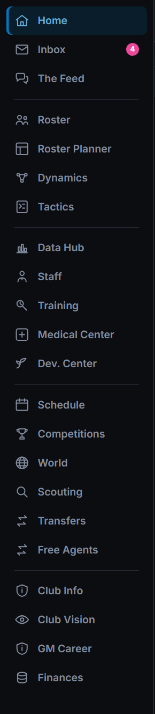
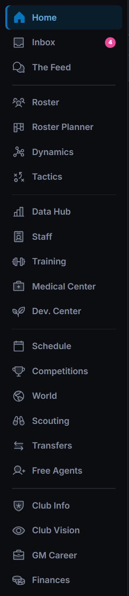
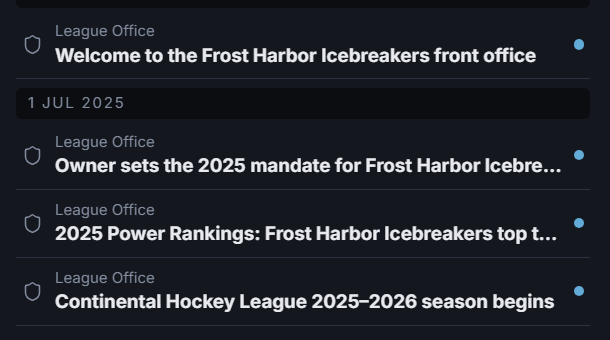
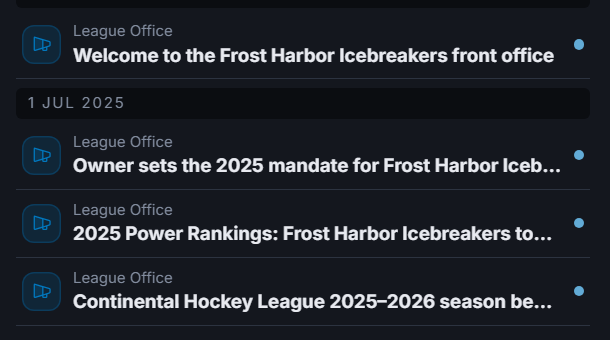
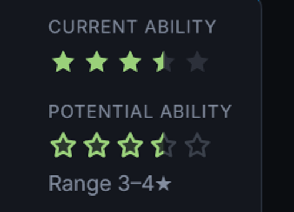
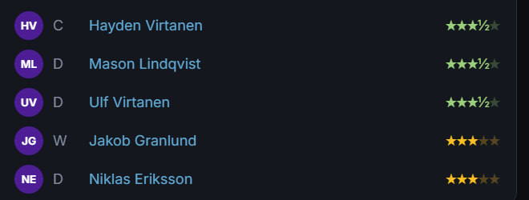
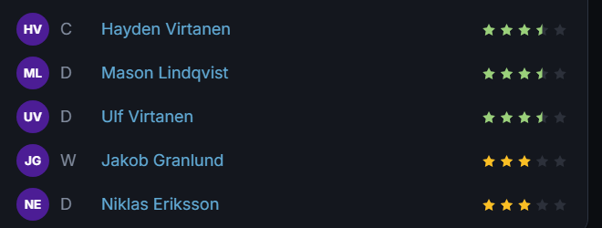
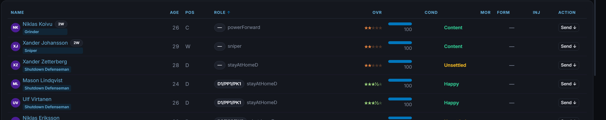
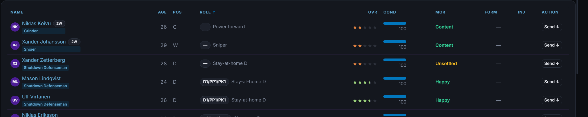

# UI polish pass — icons, stars, most-seen surfaces (2026-09-26)

Bar: EXCELLENCE B7.3 / B7.6 ("one visual language"). Driven by the GM's playtest words:
*"I don't like the icons we have. They look worse than emojis."* · *"Snowflake icon for
general emails."* · *"Star-rating colours are unexplained and not intuitive."* ·
*"true modern UI … graphics (not just emojis), top-of-the-line polish."*

Screenshots come from the real Electron build via `scripts/dev/ui-polish-snap.mjs`
(seed 424242, first club, offseason day 1, 1760×990 window), before = `improve-loop`
@ 04285c4, after = this branch.

## 1. Icons — lucide → Phosphor (duotone)

**Why the old set failed.** lucide is a single-weight 2px *outline* family. At the
14–16px the app uses, every glyph thinned to the same grey wire (an earlier pass
already tried thinning the stroke per size; it was still wireframe). Emoji read
better because they are *solid shapes with colour* — so the fix is a family that has
solid weights, not a different outline set.

**What replaced it.** `@phosphor-icons/react` **2.1.10** (MIT), one family drawn in six
weights on one grid, used in three registers:

| Register | Weight | Where |
|---|---|---|
| Content | **duotone** (outline + 20% tint of the same colour) | news categories, awards, calendar beats, banners |
| Chrome | **bold** | chevrons, tick, close, back/forward, trend arrows |
| Press-me | **fill** | play / pause / fast-forward, rating star, active nav item |

The nav rail's hand-drawn line art (a leaf for Dev. Center, an ellipse for a match,
one "info" shield shared by Club Info *and* GM Career) is now Phosphor too:
duotone at rest, **fill when active**, with a hover lift and press settle.

| Nav rail before | after |
|---|---|
|  |  |

**F1 follow-through.** The league category (the inbox's catch-all) was a snowflake,
then a plain shield; it is now a **megaphone — an announcement from the league office**,
shown in a category-tinted tile on the dashboard and a tinted disc in the inbox
(it was grey-on-grey). The snowflake survives only on the Holiday Roster Freeze.

| Dashboard messages before | after |
|---|---|
|  |  |

**Call-site API unchanged:** screens still write `<Icon size={16}><Icons.Trade /></Icon>`
and `<CategoryIcon category=… />` (new optional `tile`). Nothing imports Phosphor
directly; `lucide-react` and its type shim are **removed**. Phosphor is imported
per-icon (`@phosphor-icons/react/dist/csr/<Name>`) so the dev server/vitest never load
the ~1,500-icon barrel.

### Icon mapping (`src/renderer/components/icons.tsx`)

| `Icons.` | Phosphor | weight | | `Icons.` | Phosphor | weight |
|---|---|---|---|---|---|---|
| Result | Lightning | duo | | Briefcase | Briefcase | duo |
| Injury | FirstAidKit | duo | | Deadline | Alarm | duo |
| Trade | ArrowsLeftRight | duo | | Cut | Scissors | duo |
| Contract | FileText | duo | | DevCamp | GraduationCap | duo |
| Draft | Target | duo | | Board | Bank | duo |
| Award / AwardRibbon | Medal | duo | | Phone | Phone | duo |
| **League** | **MegaphoneSimple** | duo | | Waivers | ListChecks | duo |
| Freeze | Snowflake | duo | | History | Scroll | duo |
| Milestone | SealCheck | duo | | Arbitration | Scales | duo |
| Playoffs / Trophy | Trophy | duo | | Pin | PushPin | duo |
| Scouting | Binoculars | duo | | Settings | GearSix | duo |
| Search | MagnifyingGlass | bold | | Signing | Signature | duo |
| Form | Pulse | duo | | Interview | Microphone | duo |
| Health | ShieldCheck | duo | | Flag | Flag | duo |
| Shield | Shield | duo | | Training | Barbell | duo |
| Medical | Stethoscope | duo | | Lock | Lock | duo |
| Up / Down | TrendUp / TrendDown | bold | | Sparkle | Sparkle | duo |
| Squad | UsersThree | duo | | Warning | Warning | duo |
| Calendar | CalendarBlank | duo | | Globe | GlobeHemisphereWest | duo |
| CalendarBooked | CalendarCheck | duo | | Home | House | duo |
| Money | CurrencyDollar | duo | | Broadcast | Broadcast | duo |
| Tactics | Strategy | duo | | Megaphone | Megaphone | duo |
| Deal | Handshake | duo | | Mail | EnvelopeSimple | duo |
| Hot | Fire | duo | | Ticket / Wrench / Heart | same names | duo |
| Bell | Bell | duo | | Person | User | duo |
| News | Newspaper | duo | | Check | CheckCircle | duo |
| Chart | ChartLineUp | duo | | Replay | FilmReel | duo |
| Rivalry | Sword | duo | | Dice | DiceFive | duo |
| Star | Star | fill | | Pending | HourglassMedium | duo |
| StarOutline | Star | bold | | Watch | Eye | duo |
| Volume / VolumeOff | SpeakerHigh / SpeakerSlash | duo | | Play / Pause / FastForward | same | fill |
| Restart | ArrowCounterClockwise | bold | | ChevronUp/Down/Left/Right | Caret* | bold |
| Back / Forward | ArrowLeft / ArrowRight | bold | | Tick / Close | Check / X | bold |
| Circle / Dot | Circle / DotOutline | fill | | | | |

Nav rail (`NavIcon.tsx`): Home House · Inbox Tray · Feed ChatsCircle · Roster UsersThree ·
Roster Planner Kanban · Dynamics Graph · Tactics Strategy · Data Hub ChartBar · Staff
IdentificationBadge · Training Barbell · Medical FirstAidKit · Dev. Center Plant ·
Schedule CalendarBlank · Competitions Trophy · World GlobeHemisphereWest · Scouting
Binoculars · Transfers ArrowsLeftRight · **Free Agents UserPlus** (new key) · Club Info
ShieldStar · Club Vision Eye · **GM Career Briefcase** (new key) · Finances Coins · match Hockey.

**Emoji / text-glyph iconography.** The renderer had no pictographic emoji left; what
remained were *typographic* glyphs acting as icons. Replaced where they were icons:
▶ ⏸ ↺ ⏩ (match viewer transport), ☆/★ watch toggles (now an eye — a star only ever
means a rating now), ◄ ► prev/next player, ✓ Mark all read, ✕ ticker close. Kept on
purpose: "→" in text-button labels ("Open inbox →") and ▲▼ sort/delta markers — those
are typography, as in FM.

## 2. Star ratings (F3) — colour = tier, shape = what, stripes = uncertainty

One SVG renderer, `StarRating` in `components/Stars.tsx`, replaces **eleven** private
star renderers (profile ×2, draft, draft rankings, development, scouting, scout finds,
tactics line board, world, team pipeline, progress table). The old text version mixed
a font's ★ with a "½" digit, so 3½ rendered as `★★★½★` at a different baseline.

- **Colour = tier**, one ordered ramp (Elite green → Top-six → Regular amber → Depth
  orange → Fringe grey), named in words in every tooltip ("Ability: Top-six — drives a
  top line or top pair (3½ of 5)").
- **Shape = what is rated.** Ability = **solid** stars. Potential = **outlined** stars
  (a ceiling, not a fact) — distinguishable even in greyscale.
- **Fog reads as fog.** A scout's range draws solid to the low end and **striped** to
  the high end (was: the midpoint at 60% opacity — which looked like a *worse* player).
  No read at all = five **dashed** outlines + "?" (was: a dash, or a low grade).
- The roster legend (`StarsLegend`) now keys both the colours and the shapes.

| Profile (after) | Dashboard core (before → after) |
|---|---|
|  |   |

## 3. F2 — lever-audit output on Tactics

Already resolved on `improve-loop` before this pass: the Tactics banner speaks as the
assistant coach ("He thinks you are leaving results out there"), no decimals, no
methodology. Verified on screen (`polish-after-tactics.png`). No test pins the old
phrase (only a doc comment in `TacticsScreen.tsx` quoting it); LEVER-AUDIT.md untouched.

## 4. Most-seen surfaces

- **Roster**: Cond/Mor headers were right-aligned over left-aligned cells, so each
  label sat over the wrong column; role printed raw keys ("powerForward",
  "stayAtHomeD") — now coach words ("Power forward", "Stay-at-home D") on roster and
  profile via `playerRoleLabel()`.
- **Buttons**: a press state (1px settle) — hover existed, press did not.
  Reduced-motion users get none of the transforms.
- **Inbox**: category discs tinted by category, larger glyph.
- Fixed in passing: `FreeAgentMarketScreen` passed `overall=` (not a prop) to
  `OverallStars`, so that column rendered a meaningless grade.

| Roster before | after |
|---|---|
|  |  |

Full-screen pairs: `ui/polish-{before,after}-{dashboard,inbox,squad,tactics}.png`,
`ui/polish-after-player-profile.png`.

## Dependency change

| Added | Removed |
|---|---|
| `@phosphor-icons/react` **2.1.10** — MIT, exact pin, installed `--ignore-scripts --save-exact`; zero dependencies, no install scripts; publisher `rektdeckard` (Phosphor's author), repo github.com/phosphor-icons/react; last publish 2025-05 | `lucide-react` 1.24.0 and `src/renderer/types/lucide-react.d.ts` |

## Build fix found on the way

`electron-vite build` was **broken on improve-loop** ("Invalid value 'iife' for option
'worker.format'") since the voice worker started lazy-importing kokoro-js — which also
means `npm run ui:snap` could not run. `worker: { format: 'es' }` in
`electron.vite.config.ts` fixes it (workers are already constructed as module workers).

## Not done (and why)

- **No layout redesigns** (brief: refine, don't redesign). The player-profile header
  still spends ~200px on the Role/Trade selects; worth its own pass.
- **Dashboard empty "Around the League" / tall "Offseason desk" panels** on offseason
  day 1 — phase-aware panel swaps are dashboard-law work beyond icon/type polish.
- **Match viewer / gamecast (F4)** and **Feed (F5)** — separate playtest items; only
  their transport-control glyphs were swapped here.
- ▲▼ sort/delta markers and "→" button suffixes stay as typography (see §1).
- Two text-star strings remain: `ScoutProfileScreen` (a scout's own find list) and the
  "3 stars of the game" glyphs in `MatchNightFrames` (not a rating scale). Low traffic;
  convert with `StarRating` / `PotentialStars` when those screens are next touched.
